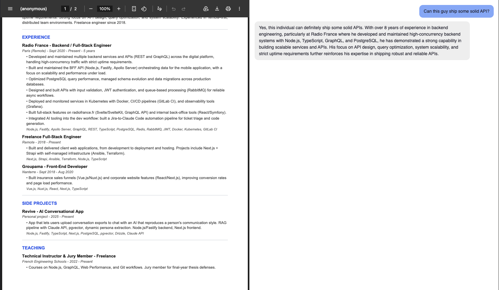

# GoRAG

A local RAG (Retrieval-Augmented Generation) application built with Go.  
Upload PDFs and chat with them using a local LLM, no external API, no cost, everything runs on your machine.



## Why

Built as an exploration of Go. The goal was to learn Go by building something real: HTTP servers, goroutines, interfaces, error handling rather than toy examples.

## Stack

- **Go** — HTTP API (`net/http`)
- **Weaviate** — vector store (Docker)
- **Ollama** — embeddings (`nomic-embed-text`) and LLM (`qwen2.5:7b`)
- **HTML/JS** — minimal frontend served by Go

## How it works

1. Upload a PDF → text is extracted, split into chunks, embedded via Ollama, stored in Weaviate
2. Ask a question → the question is embedded, similar chunks are retrieved, a prompt is built and sent to the LLM
3. The response streams back token by token

## Run

```bash
# Start Weaviate
docker compose up -d

# Start the server
go run .
```

Open `http://localhost:4557`.
